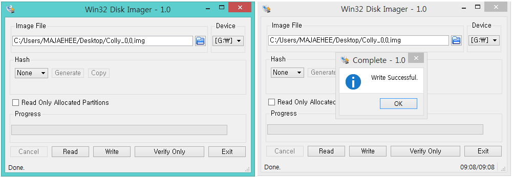
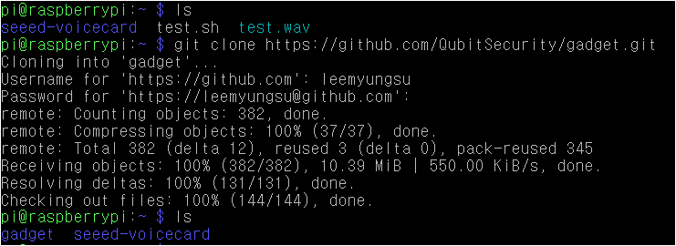
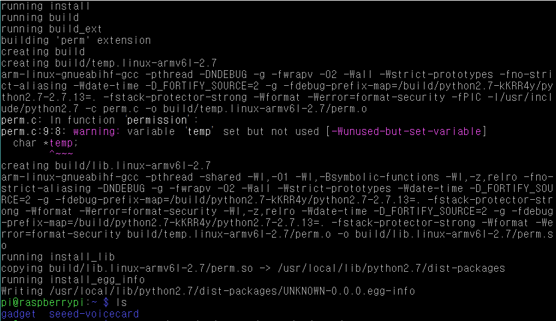
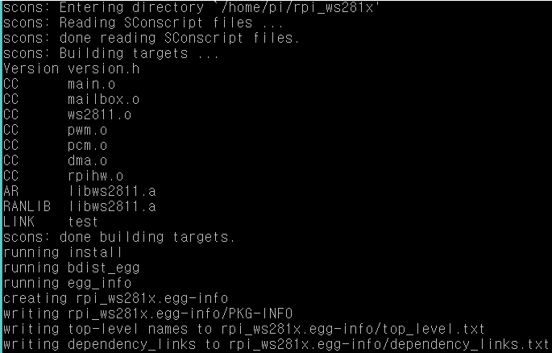
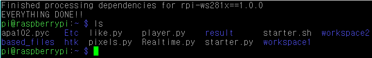
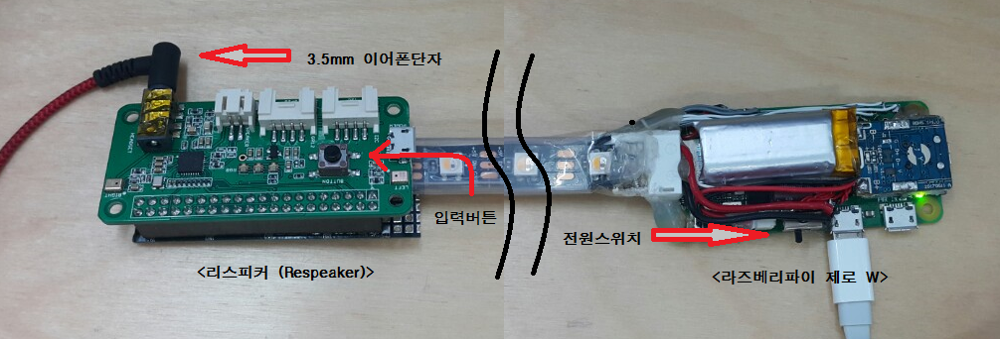

hi
# gadget
> gadget은 라즈베리파이를 이용한 음성인식 프로젝트로,   
> 음성명령에 의한 LED 교통시그널을 출력하는 블루투스 넥밴드 입니다.  

## 사용설명  

- 마이크로SD카드에 Win32 Disk Imager를 이용하여 OS를 설치합니다.  

  

- gadget 프로젝트를 해당 기기에 복사합니다. (깃허브 계정 필요)
```
git clone https://github.com/QubitSecurity/gadget.git
```
  

## BASIC
> BASIC폴더는 OS 설치 및 환경설정이 완료된 SD카드의 시리얼넘버를 고유변수로 사용하여  
> OS의 무단복제 및 배포를 막기 위한 스크립트 모음.  

perm.c 와 permm.py가 실제 실행을 위한 보안스크립트이며  
파이썬 모듈생성 및 시리얼넘버 변수설정을 위한 스크립트가 포함되어 있습니다.

* #### 설치 및 사용방법
1. BASIC 폴더내부의 파일들을 /home/pi로 복사합니다.
```
sudo mv /home/pi/gadget/BASIC/* /home/pi
```
2. setting.sh을 실행하면 자동설정 됩니다.  ++setting.sh 내부 주석 참조++
```
sh /home/pi/setting.sh
```  
  

3. 설정이 완료되면 `perm`과 `permm` 모듈을 사용할 수 있습니다. 기록에서 삭제할 파일이나 불필요해진 파일은 자동으로 삭제됩니다.

* * *
  
## FINAL
> FINAL폴더는 BASIC 셋팅이 끝난 후, 실시간 음성인식과 음성피드백 및 블루투스 관련 유틸리티 등등  
> 실제 사용하는 스크립트 모음.

Realtime.py 와 player.py가 실제 실행을 위한 스크립트이며
실시간 음성인식 & 음성피드백 기능을 구현 하였습니다.

* #### 설치 및 사용방법
1. FINAL 폴더내부의 파일들을 /home/pi로 복사합니다.
```
sudo mv /home/pi/gadget/FINAL/* /home/pi
```
2. install.sh를 실행하면 자동설정 됩니다.  ++install.sh 내부 주석 참조++
3. 실행 전 인터넷이 연결 되어야 합니다.
```
sh /home/pi/install.sh
```  
  

4. 설치가 완료되면 `starter.py`를 실행하여 음성인식을 사용합니다.
```
python /home/pi/starter.py
```
  


5. starter.py 실행이 시작되면 황색 LED가 왕복점등되며, 리스피커의 버튼을 누르면 모드변환이 됩니다.  
Default는 대기모드이며, 버튼 클릭 시 음성인식모드와 대기모드가 toggle 됩니다.
```
대기모드 <= 버튼클릭 => 음성인식모드
```
6. 음성인식모드 에서는 명령어를 연속적으로 인식합니다.

#### * 각 스크립트의 상관관계
```
starter.py <= pairing.py
              starter.sh <= player.py
                            Realtime.py <= hcopy.so
                                        <= hvite.so
                                        <= like.py
                                        <= pixel.py <= apa102.pyc
                                        <= permm.pyc <= perm.so 
                                        <= Trainning_sw.py <= Rec_al.py
                                                              create.py <= new_codetr.py
```

## 실행방법
1. ```python /home/pi/starter.py```   
: 실행 시 버튼 누르고 있으면 페어링모드 진입.  
: (if not 버튼클릭) 실시간 음성인식(버튼 트리거) + 음성피드백 실행.  

2. ```python /home/pi/Etc/BLE.py```  
: 실행 후 명령어 타이핑+엔터 -> 해당 동작 실행.  
: ['play':재생-일시정지, 'stop':정지, 'next':다음곡, 'pre':이전곡, 'fast':빨리감기, 'rewind':뒤로감기]  
: ['show':현재 곡정보 표시, 'up':볼륨업, 'down':볼륨다운, 'quit':스크립트 종료]  

3. ```sudo python /home/pi/Etc/led_test.py N ```  
: N에 숫자(1~6)을 써서 실행시키면 각 명령어의 LED시그널 표시.  

4. ```sudo python /home/pi/Etc/pairing.py```  
: 실행하면 1번 LED가 빨-파 교차점등(60초).   
: 교차점등할 때 블루투스 기기 검색 후 ("raspberrypi") 페어링.  
: 페어링 시 1번 LED가 초록색으로 바뀜.  
: 연결완료시 1번 LED꺼지며 기기등록 완료.  

5. ```python /home/pi/Etc/wav.py```  
: 음성트레이닝용 녹음파일을 명령어마다 재생.  
: 해당 폴더의 번호 + 해당 명령어 번호 = 녹음된 명령어 랜덤재생.  

6. ```sudo python /home/pi/htk/MakeDB.py```  
: DB화 시킬 트레이닝 폴더의 번호 선택.  
: mfcc파일 여부 타이핑 (yes/no).  
: /home/pi/based_files/previousDB 폴더에 mfcc파일 복사됨.  

7. ```sudo python /home/pi/htk/Trainning.py```  
: 콘솔창에서 트레이닝 가능.  
: 실행 후 1~6번까지의 명령어 번호+엔터=1.5초간 해당 명령어 녹음됨.  
: 녹음 완료 후 트레이닝 실행하면 선택한 트레이닝 음성모델이 바로 적용됨.
